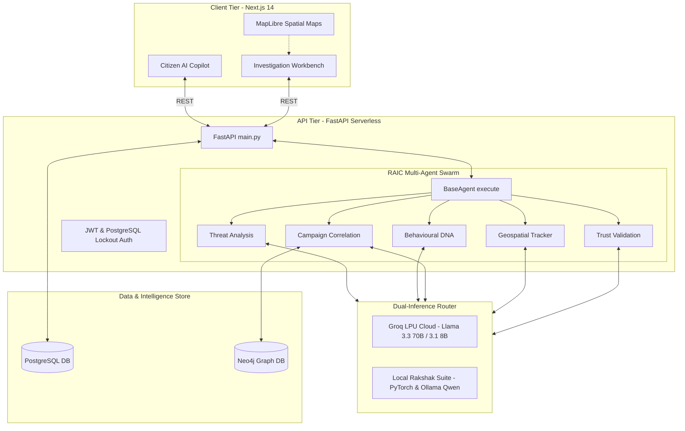

# Digital Rakshak: AI-Powered Cyber Threat Intelligence Platform

**Digital Rakshak** is a next-generation, hybrid AI-driven cyber-threat intelligence, classification, and prevention platform built to combat organized financial fraud and cybercrime in India. 

Moving beyond reactive complaint registration, Digital Rakshak leverages a massive **Multi-Agent AI Swarm**, **Graph Intelligence (Neo4j)**, and **Spatial Threat Mapping** to automatically identify organized crime syndicates, extract attack DNA, and provide actionable intelligence to Law Enforcement Agencies (LEAs), nodal officers, and citizens.

---

## 🚀 Unified Dual-Mode Architecture (Cloud vs. Offline)

Digital Rakshak features a state-of-the-art **Dual-Inference Engine** configured globally via the `DEFAULT_AI_MODE` environment variable. This allows the system to easily adapt to different deployment requirements:

### 1. Cloud-Native Mode (`groq`) — *Optimized for Serverless (Vercel)*
When set to `groq`, the entire platform shifts its heavy analytical workloads to **Groq's high-speed LPU (Language Processing Unit) Cloud Infrastructure**, bypassing all heavy local dependencies:
*   **The 11 AI Engines Swarm:** Dynamically routed in parallel to Groq's **Llama 3.3 70B** (`llama-3.3-70b-versatile`) model for deep reasoning, legal compliance, and behavioral analysis.
*   **RAIC Decision Core & Global Chat:** Routed to Groq's **Llama 3.1 8B** (`llama-3.1-8b-instant`) model, leveraging a massive **128,000 token context window** to allow conversational analysis of entire case sheets without token limits.
*   **AI Copilot Transcription:** Sends voice evidence directly to Groq's **Whisper API** (`whisper-large-v3`) in the cloud.
*   **Zero-Hardware Footprint:** Runs instantly on Vercel Serverless Functions with zero memory/size limit crashes.

### 2. Local Native Mode (`auto` / `ollama`) — *Optimized for Secure Air-Gapped LEA Servers*
When set to local mode, the platform runs 100% self-contained on your own hardware with **zero external API calls or internet dependencies**, guaranteeing absolute data privacy for Law Enforcement:
*   **Rakshak Core (PyTorch):** The `ThreatAnalysisAgent` boots up our custom-trained **Rakshak Multi-Task Model** (a fine-tuned `distilbert-base-multilingual-cased` neural network) directly in CPU/GPU memory to perform multilingual Indian scam classification in under 15ms.
*   **Local LLM Reasoning:** The analytical agents route their prose-generation prompts to a local **Ollama** daemon (running `qwen2.5:7b` or similar).
*   **Local Audio Transcription:** The `WhisperAgent` runs a local **`faster-whisper`** instance.
*   **Local Screenshot OCR:** The `VisionAgent` runs a local **EasyOCR** English/Hindi reader.

---

## 🧠 The 11 Active Specialist Subagents (MAIF v10.0 Swarm)

The platform orchestrates 11 specialized subagents to analyze every case before the final fusion:

### Ingestion & Classification
1.  **ThreatAnalysisAgent:** The primary classifier. Powered by the custom **Rakshak-Text (PyTorch)** model offline, it maps scams into 5 distinct threat classes (Safe, Banking Fraud, UPI Fraud, Courier Scam, Digital Arrest) and outputs a calibrated confidence score.
2.  **WhisperAgent:** The ears of the platform. Transcribes citizen voice recordings into text.
3.  **VisionAgent:** The eyes of the platform. Extracts text, URLs, and banking details from uploaded screenshots (WhatsApp chats, fake payment receipts).

### Deep Analytical Engines (Parallel execution)
4.  **BehaviourAgent (Rakshak-Behaviour):** Analyzes the attacker's psychological tactics (Fear, Urgency, Impersonation) to fingerprint the attack's behavioral DNA.
5.  **CampaignAgent (Rakshak-Link):** Uses local sentence embeddings (`BAAI/bge-small-en-v1.5`) to vector-search the database, clustering similar cases into unified, coordinated scam campaigns.
6.  **GeoAgent (Geo-Resolver):** Resolves geographic identifiers (cities, regions) mentioned in text to calculate spatial threat density.
7.  **TrustValidationAgent (ZTIVF):** Computes a multi-dimensional trust score based on reporter validation, checking for potential data-poisoning.

### Post-Processing & Persistence
8.  **TimelineAgent:** Builds a step-by-step chronological narrative of how the victim was targeted and scammed.
9.  **KnowledgeAgent:** Cross-references threat patterns with real-world Indian regulatory frameworks (RBI circulars, TRAI rules, IT Act).
10. **RecommendationAgent:** Formulates concrete actions for investigators (e.g. *"Freeze target Bank Account X"*, *"Block Phishing Domain Y"*).
11. **IntelligenceAgent:** Extracts all parsed entities (Phones, UPIs, IPs) and commits them as nodes and relationships in the **Neo4j Graph Database**.

---

## 🛠️ Complete Feature List

1.  **Multi-Agent AI Swarm (RAIC Core):** Paralleled pipeline of 11 agents coordinated by a supreme decision core to mathematically fuse scores and generate explanations.
2.  **AI Citizen Copilot:** Allows citizens to speak complaints or upload screenshots, automatically drafting official LEA-formatted reports.
3.  **Organized Syndicate Tracking (Neo4j):** Links independent complaints sharing identical bank accounts, UPIs, or phone numbers to expose cybercrime syndicates.
4.  **Spatial Threat Heatmapping:** Geographically plots scams on MapLibreGL maps, highlighting organized scam hotspots (Jamtara, Mewat) while preserving reporter privacy.
5.  **Automated APK Malware Sandbox:** Analyzes uploaded Android `.apk` files, flags malicious permissions (SMS hijacking, remote overlays), and integrates findings into the AI score.
6.  **Automated Legal Takedowns:** Drafts legally compliant takedown notices tailored for NPCI, Google, Cloudflare, or local banks.
7.  **Serverless Progressive Lockout Auth:** Security-hardened passwordless OTP and RBAC logins utilizing a Redis-free PostgreSQL lockout algorithm to prevent brute-force attacks.
8.  **Self-Healing Database Migrations:** Automatically executes Alembic migrations programmatically inside FastAPI's startup event on Vercel/serverless environments.

---

## 🏗️ System Architecture



---

## 💻 Technology Stack

*   **Frontend:** Next.js 14 (App Router), React, Tailwind CSS, MapLibre GL, Framer Motion, Axios.
*   **Backend:** FastAPI, Python 3.12, SQLAlchemy 2.0 (Async), Asyncpg.
*   **Databases:** PostgreSQL (Relational & pgvector embeddings) and Neo4j (Graph data).
*   **AI Integration:** Groq Cloud LPU API (Llama 3.3 70B, Llama 3.1 8B, Whisper-large-v3), Local PyTorch (`xlm-roberta-base`), Local Ollama (`qwen2.5:7b`), Local EasyOCR.
*   **Deployment:** Vercel (Frontend & Serverless Backend).

---

## 🔧 Local Development Setup

### 1. Start the Databases (Docker)
```bash
docker-compose up -d
```

### 2. Backend Setup
```bash
cd backend
python -m venv venv
# Windows: venv\Scripts\activate
# Mac/Linux: source venv/bin/activate

pip install -r requirements.txt
```
*   Create a `backend/.env` file containing your `DATABASE_URL`, `NEO4J_URI`, and `GROQ_API_KEY`.
*   Run database migrations and seed mockup threat cases:
```bash
# Migrations run programmatically on server start, but you can also run manually:
alembic upgrade head
python scripts/seed_diverse_cases.py
uvicorn main:app --reload --port 8000
```

### 3. Frontend Setup
```bash
cd frontend
npm install
```
*   Create `frontend/.env.local` containing: `NEXT_PUBLIC_API_URL=http://127.0.0.1:8000/v1`
```bash
npm run dev
```
*   The application will be available at **`http://localhost:3000`**.


---

## 🐳 Docker Hub Quick Start (Pre-Built Images)
To run the platform without manually compiling PyTorch or setting up Node.js locally, you can pull our pre-built production images directly from Docker Hub:

### 1. Backend Service (Includes Python stack)
*   🔗 **[View Backend Image on Docker Hub](https://hub.docker.com/r/1065925/digital-rakshak-backend)**
```bash
docker pull 1065925/digital-rakshak-backend:latest
docker run -d -p 8000:8000 --env-file ./backend/.env --name dr-backend 1065925/digital-rakshak-backend:latest
```

### 2. Frontend Service (Includes Next.js build)
*   🔗 **[View Frontend Image on Docker Hub](https://hub.docker.com/r/1065925/digital-rakshak-frontend)**
```bash
docker pull 1065925/digital-rakshak-frontend:latest
docker run -d -p 3000:3000 --env-file ./frontend/.env.local --name dr-frontend 1065925/digital-rakshak-frontend:latest
```

---

## 🔒 Security & Contribution
This repository utilizes strict `.gitignore` rules to prevent credentials (`.env`, local database volumes, model weights) from being committed to public version control. If deploying, configure your cloud environment variables via Vercel or your hosting dashboard.

**Developed for a Safer Digital India.**
