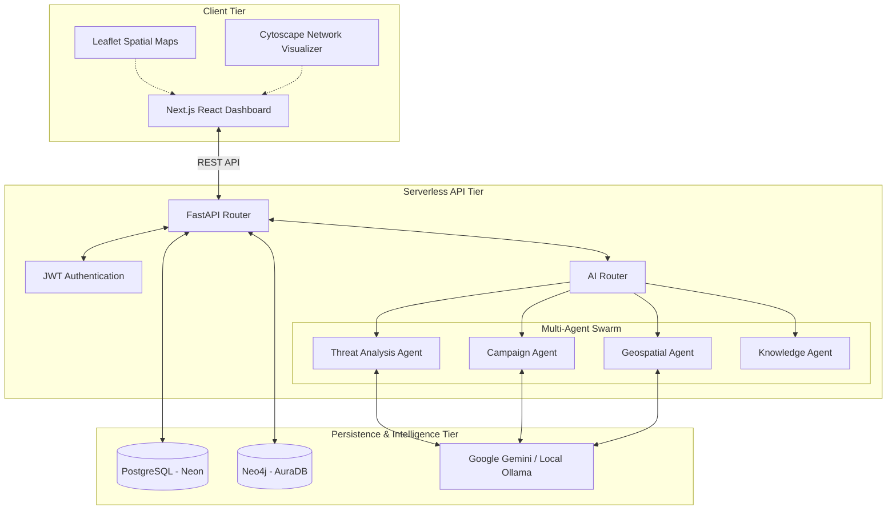

# Digital Rakshak

Digital Rakshak is an advanced, AI-powered cyber-threat intelligence and prevention platform designed to combat organized financial fraud in India. 

The system leverages a multi-agent AI architecture to ingest scattered cybercrime reports, cross-reference them in real-time using a Neo4j knowledge graph, and automatically identify organized crime syndicates operating across state lines. By finding the hidden links between seemingly isolated cases—such as shared bank accounts, recurring crypto wallets, or identical threat actor behavioral patterns—Digital Rakshak empowers law enforcement, nodal officers, and citizens to move from a reactive stance to a proactive defense.

## System Architecture

The application is designed as a unified monorepo deploying both the Next.js frontend and the FastAPI backend onto Vercel Serverless Functions.



## Technology Stack

- **Frontend:** Next.js 14, React, Tailwind CSS, Recharts, Cytoscape.js, React Leaflet.
- **Backend:** FastAPI, Python 3.11+, SQLAlchemy 2.0 (Async), Asyncpg.
- **Databases:** PostgreSQL (Relational schema, Vector embeddings) and Neo4j (Graph data for tracking organized syndicates).
- **AI Integration:** Google Gemini Pro (Primary) and Ollama (Local fallback for air-gapped environments).
- **Deployment:** Vercel (Monorepo hosting for both Next.js and FastAPI), Neon (Postgres hosting).

## Core Features

1. **Multi-Agent AI Swarm:** Different AI agents specialize in specific tasks (e.g., extracting Indicators of Compromise, mapping geospatial threats, tracing financial flows). The `AIRouter` dynamically dispatches tasks to the appropriate agent.
2. **Graph Intelligence:** Every reported phone number, UPI ID, and crypto address is mapped as a node in Neo4j. When multiple cases point to the same node, the system flags a massive organized campaign.
3. **Role-Based Access Control (RBAC):** Distinct dashboards for Citizens, Investigators, Nodal Officers, Cyber Cell, Policy Makers, and Admins.
4. **Spatial Heatmaps:** Real-time geographical visualization of scam density and live attacks across the country.
5. **Automated Takedowns:** Nodal officers can trigger automated API requests to block fraudulent bank accounts or take down malicious domains via the Takedown engine.

## Local Development Setup

### Prerequisites
- Python 3.11 or higher
- Node.js 18 or higher
- Docker and Docker Compose

### 1. Clone the Repository
```bash
git clone https://github.com/beastspirit2005/Digital-Rakshak.git
cd Digital-Rakshak
```

### 2. Start the Local Databases
We use Docker to run PostgreSQL, Neo4j, and Redis locally.
```bash
docker-compose up -d
```

### 3. Backend Setup
```bash
cd backend
python -m venv venv
# On Windows
venv\Scripts\activate
# On Mac/Linux
source venv/bin/activate

pip install -r requirements.txt
```

Create a `.env` file in the `backend` directory based on `.env.example`.
Run database migrations and seed the data:
```bash
alembic upgrade head
python seed_admin.py
python scripts/seed_diverse_cases.py
```

Start the FastAPI server:
```bash
uvicorn main:app --reload --port 8000
```

### 4. Frontend Setup
Open a new terminal window.
```bash
cd frontend
npm install
```

Create a `.env.local` file in the `frontend` directory:
```env
NEXT_PUBLIC_API_URL=http://127.0.0.1:8000/api/v1
```

Start the Next.js development server:
```bash
npm run dev
```
The application will be available at `http://localhost:3000`.

## Production Deployment

Digital Rakshak is configured for zero-configuration deployment on Vercel using the experimental monorepo setup (`vercel.json`).

1. Link the repository to Vercel.
2. Add the backend environment variables (`DATABASE_URL`, `NEO4J_URI`, `GEMINI_API_KEY`, etc.) in the Vercel project settings.
3. Set `NEXT_PUBLIC_API_URL` to `/api`.
4. Deploy. Vercel will automatically build the Next.js frontend and deploy the FastAPI backend as Serverless Functions, completely bypassing CORS issues.

## Security Notice

This repository utilizes strict `.gitignore` rules to prevent credentials from being committed. Do not bypass these rules. If you are developing locally, always keep your actual keys inside the `.env` file, which is safely ignored by Git.
