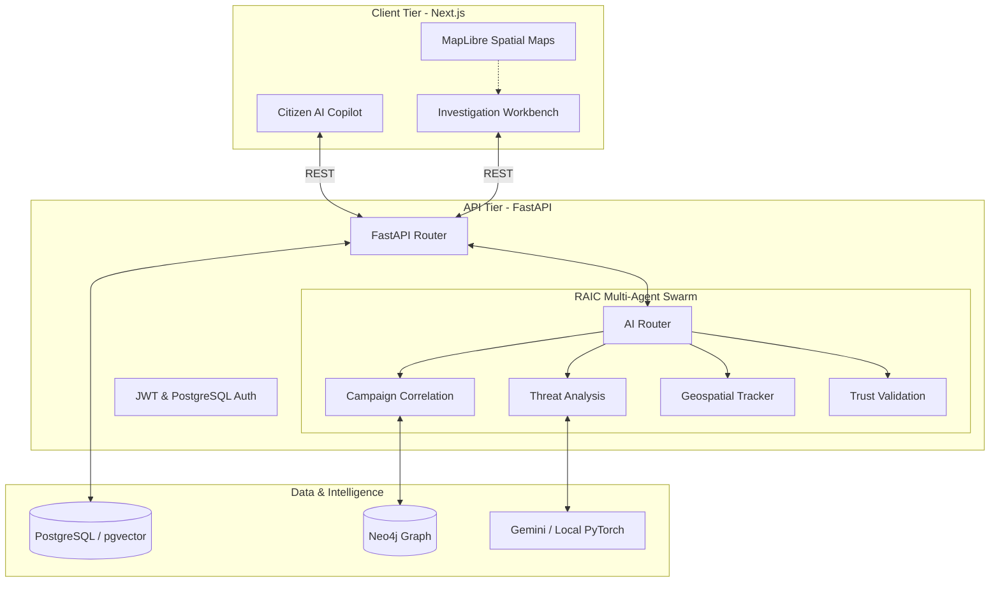

# Digital Rakshak: AI-Powered Cyber Threat Intelligence Platform

**Digital Rakshak** is a next-generation, AI-driven cyber-threat intelligence and prevention platform built to combat organized financial fraud and cybercrime. 

Moving beyond reactive complaint registration, Digital Rakshak leverages a massive **Multi-Agent AI Swarm**, **Graph Intelligence (Neo4j)**, and **Spatial Threat Mapping** to automatically identify organized crime syndicates, extract attack DNA, and provide actionable intelligence to Law Enforcement Agencies (LEAs), nodal officers, and citizens.

---

## Comprehensive Feature List

### 1. Multi-Agent AI Swarm (RAIC Core)
The heart of Digital Rakshak is the **R**esponsive **A**I **I**ntelligence **C**ore (RAIC), which dynamically routes every submitted case through a parallel pipeline of specialized AI agents:
*   **Threat Analysis Agent:** Extracts Indicator of Compromise (IoC) vectors like malicious UPI IDs, crypto wallets, and phishing domains.
*   **Trust & Validation Agent:** Computes a mathematical "Trust Score" using ZTIVF (Zero Trust Identity & Verification Framework) rules.
*   **Behavioural DNA Agent:** Analyzes the psychological tactics used by the attacker (Urgency, Fear, Authority Impersonation).
*   **Campaign Agent:** Cross-references the attack DNA with the national database to detect if this is part of a larger, coordinated campaign.

### 2. AI Citizen Copilot & Evidence Extraction
A fully interactive reporting interface where victims can simply **speak** about what happened to them or upload evidence. 
*   **Whisper Audio Extraction:** Automatically transcribes voice complaints and extracts crucial threat indicators.
*   **Vision OCR Extraction:** Scans uploaded screenshots (e.g., WhatsApp chats, fake payment receipts) to extract textual evidence.
*   **Automated FIR Formatting:** Drafts an official report formatted perfectly for LEAs.

### 3. Organized Syndicate Tracking (Neo4j)
Every phone number, UPI ID, and malicious URL is stored as a node in a **Neo4j Graph Database**. When multiple victims report cases involving the same phone number or bank account, the Intelligence Graph automatically links them, exposing the hidden infrastructure of organized syndicates.

### 4. Spatial Threat Mapping
Real-time geographic visualization of cyber attacks using MapLibre. Watch threat clusters form on the map as the AI isolates coordinated attacks originating from specific regions (e.g., Jamtara, Mewat), with privacy-preserving geolocation jitter applied for citizen anonymity.

### 5. Automated Malware Sandbox (APK Scanner)
Citizens can upload suspicious Android apps (.apk). The system conducts a static analysis sandbox scan to identify dangerous permissions (e.g., SMS reading, OTP interception, overlay attacks) typical of Banking Trojans, automatically fusing this intelligence into the AI threat score.

### 6. Automated Takedown Engine
When a high-confidence threat (e.g., a phishing domain or rogue UPI ID) is detected, the **Takedown Generation Agent** automatically drafts legally compliant takedown requests tailored to the specific platform (Google, Cloudflare, NPCI) and jurisdiction, accelerating the neutralization of the threat.

### 7. Progressive Serverless Authentication
Built for massive scale and DoS resilience, Digital Rakshak uses a **Redis-free PostgreSQL Progressive Lockout** authentication system. 
*   **Passwordless OTP Login:** Citizens can log in via secure, escalating-timeout email OTPs.
*   **Role-Based Access Control (RBAC):** Strict boundaries separating Citizens, Police Officers, Cyber Cell Analysts, and Bank Employees.

### 8. Dual-Inference Engine (Cloud + Local Edge)
Built for air-gapped security environments. Digital Rakshak can run on cloud-based LLMs (Google Gemini Pro) for maximum reasoning capabilities, or seamlessly switch to a completely offline, local PyTorch engine (`xlm-roberta-base`) for extreme privacy.

---

## System Architecture

Digital Rakshak is built as a unified monorepo for seamless deployment.



---

## Technology Stack

*   **Frontend:** Next.js 14 (App Router), React, Tailwind CSS, MapLibre GL, Framer Motion, Axios.
*   **Backend:** FastAPI, Python 3.12, SQLAlchemy 2.0 (Async), Asyncpg.
*   **Databases:** PostgreSQL (Relational & pgvector embeddings) and Neo4j (Graph data).
*   **AI Integration:** Google Gemini Pro API, OpenAI Whisper API, Local PyTorch (`xlm-roberta`).
*   **Deployment:** Vercel (Frontend & Serverless Backend).

---

## Local Development Setup

### Prerequisites
*   Python 3.11+
*   Node.js 18+
*   Docker & Docker Compose (for databases, optional if using Neon/Aura)

### 1. Start the Databases
Start your local instances of PostgreSQL and Neo4j.
```bash
docker-compose up -d
```

### 2. Backend Setup (via Docker Hub - Recommended)
To avoid downloading massive PyTorch models locally, you can pull the pre-built backend image directly from Docker Hub. This image encapsulates the entire FastAPI application and the local LLM weights.

```bash
docker pull beastspirit2005/digital-rakshak-backend:latest
docker run -d -p 8000:8000 --env-file ./backend/.env --name dr-backend beastspirit2005/digital-rakshak-backend:latest
```

### 3. Backend Setup (Manual Source Build)
```bash
cd backend
python -m venv venv
# Windows: venv\Scripts\activate
# Mac/Linux: source venv/bin/activate

pip install -r requirements.txt
```
Create a `.env` file based on `.env.example`.
Run database migrations and start the server:
```bash
alembic upgrade head
python scripts/seed_diverse_cases.py
uvicorn main:app --reload --port 8000
```

### 4. Frontend Setup
Open a new terminal.
```bash
cd frontend
npm install
```
Create a `.env.local` file with: `NEXT_PUBLIC_API_URL=http://127.0.0.1:8000/v1`
Start the Next.js development server:
```bash
npm run dev
```
The application will be available at **`http://localhost:3000`**.

---

## Security & Contribution
This repository utilizes strict `.gitignore` rules to prevent credentials (`.env`, database volumes, model weights) from being committed. If deploying, ensure you configure your cloud provider's environment variables appropriately.

**Developed for a Safer Digital India.**
