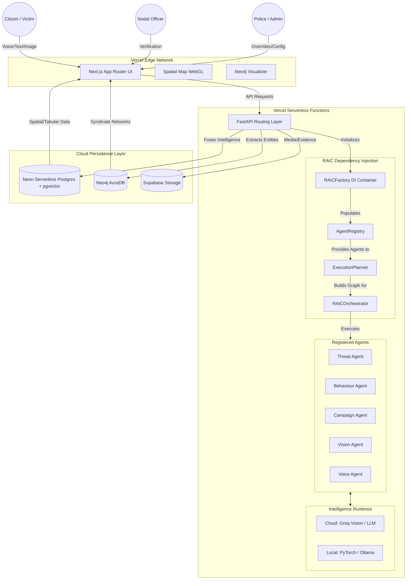

# Digital Rakshak: AI-Powered Cyber Threat Intelligence Platform

Welcome to **Digital Rakshak**! 

When a citizen becomes a victim of a cyber scam or encounters counterfeit currency, the current process is often reactive: file a complaint, get a ticket number, and wait. But organized financial crime doesn't wait; it scales. 

We built **Digital Rakshak** to flip the script. Instead of just acting as a digital complaint box, Digital Rakshak is an active **Hybrid AI Intelligence Platform**. It doesn't just read complaints; it listens to victims, extracts the behavioral DNA of the attacker, maps the threat across the country, and automatically clusters isolated incidents into organized crime syndicates. 

We are empowering Law Enforcement Agencies (LEAs), nodal officers, and citizens with military-grade intelligence and zero-trust verification.

---

## What Makes Digital Rakshak Unique?

### Version 3.0: Enterprise Architecture Upgrade
The latest release restructures the backend to improve scalability, reliability, and security when running in production serverless environments like Vercel.
*   **Fully-Wired RAIC Dependency Injection (DI) Factory:** The backend now features a robust DI container (`RAICFactory`) that cleanly instantiates Runtimes, Intelligence Engines, Capabilities, and Agents, automatically registering them into the `AgentRegistry` on boot.
*   **Decoupled Agent and Model Registry (RAIC + RIE):** Business logic is completely separated from machine learning runtimes. The registries handle model loading and execution configurations dynamically, removing hardcoded model dependencies.
*   **Robust Serverless Fallbacks:** AI Agents utilize safe-access dictionaries and graceful degradation blocks. If PyTorch offline models fail to load on Vercel due to size constraints, the system instantly falls back to Cloud Vision (Groq) without dropping the citizen's request.
*   **Topological Swarm Execution:** Uses Kahn's algorithm to resolve dependencies between different analysis agents, allowing them to run concurrently where possible.
*   **Strict Security Safeguards:** Implements immutable event logs, prompt injection protections, and magic byte validation for file uploads.

### 1. The Multi-Agent Intelligence Swarm (MAIF)
Most platforms use a single AI to answer questions. Digital Rakshak uses a swarm of specialized AI agents. When a case is filed, agents immediately go to work in parallel:
*   **The Vision Agent** scans uploaded screenshots for phishing URLs.
*   **The Threat & Behaviour Agents** extract the psychological manipulation tactics used by the scammer (mapped to MITRE ATT&CK standards).
*   **The Campaign Agent** searches the Neo4j graph database to see if this scammer is part of a larger syndicate.
*   **The Voice Agent** handles audio evidence and transcriptions natively.

### 2. Dual-Mode Architecture (Cloud vs. Air-Gapped)
Police departments and banks deal with highly sensitive Personally Identifiable Information (PII) that cannot legally be sent to external cloud APIs. 
*   **Cloud Mode:** Uses high-speed LPU infrastructure (like Groq + Llama 3.3) for rapid processing and scale on Vercel.
*   **Offline Mode:** Seamlessly falls back to a 100% air-gapped, local stack. It boots up our custom PyTorch model (`Rakshak-Text`), local `faster-whisper`, and `Qwen 2.5` to analyze data natively on the department's own hardware, ensuring zero data leakage.

### 3. Physical & Cyber Convergence (The Counterfeit Tracker)
We have unified digital and physical crime tracking. If a user uploads an image of a suspicious Rs 500 note, the system bypasses the NLP engines and routes the image to our Vision Engine. Physical counterfeits are mapped on a separate, dedicated layer on the Spatial Map, ensuring physical crimes do not pollute the cyber-threat graphs.

### 4. 6-Axis Threat DNA & Confidence Evolution
A single report is not instantly trusted. Our **RAIC Decision Core** generates a 6-Dimensional Score (Threat Severity, Behaviour, Network Linkage, Evidence Integrity, Impersonation, and Extraction). As banks and police verify the data, the system evolves the **Confidence Score** from a baseline of ~50% up to a rock-solid 99% before issuing national blocks.

### 5. Empathic AI Voice Copilot
Victims of financial fraud are often panicked. Instead of forcing them to navigate complex dropdown menus, they can simply **talk** to our AI Copilot. The system parses their voice, extracts the malicious UPIs and phone numbers, and fills out the intelligence report automatically.

### 6. Command Center & Hardware Telemetry
The platform provides a real-time Tactical Command Center powered by dynamic PostgreSQL aggregations (calculating true financial exposure and active threat hubs) rather than static data. It also features a Live AI Health Governance Desk that monitors actual CPU/GPU hardware loads dynamically.

---

## System Architecture

Our platform is divided into a sleek Next.js frontend, a robust FastAPI orchestration layer, and a multi-database persistence layer, fully optimized for serverless deployments on Vercel.



---

## The Technology Stack

We didn't just build an app; we built an enterprise intelligence engine using the best modern tools available:

*   **Frontend Interface:** Next.js 14 (App Router), React, Tailwind CSS, MapLibre GL for dynamic spatial maps, and Recharts for 6D radar visualizations. Hosted on **Vercel**.
*   **Backend Orchestration:** FastAPI (Python 3.12) deployed as **Vercel Serverless Functions** for infinitely scalable API routing.
*   **Relational & Vector Data:** **Neon Serverless Postgres** powered by SQLAlchemy 2.0 and `pgvector` for semantic clustering and high-performance connection pooling (PgBouncer).
*   **Graph Intelligence:** **Neo4j AuraDB** for mapping complex relationships between scammers, UPI IDs, and phone numbers.
*   **File Storage:** **Supabase Storage** for secure evidence and media retention.
*   **AI Models:** Groq (Llama 3, Qwen Vision), PyTorch (MobileNetV3 for vision, XLM-RoBERTa for text), and Local Ollama (Qwen 2.5).

---

## 🔐 Demo Credentials (For Judges)

The live platform is deployed at **[frontend-chi-lemon-78.vercel.app](https://frontend-chi-lemon-78.vercel.app)**

Use the following credentials to explore each role:

| Role | Email | Password | Access |
|------|-------|----------|--------|
| 👮 Police / Investigator | `police1@rakshak.com` | `police@123` | Workbench, Case Assignment, Graph Intelligence |
| 👤 Citizen / Victim | `citizen1@rakshak.com` | `citizen@123` | Report a Crime, Track Case Status, Help Chat |
| 🏛️ Admin | `admin1@rakshak.com` | `admin@123` | Command Center, User Management, Full Platform |
| 🏦 Banker / Nodal Officer | `banker1@rakshak.com` | `banker@123` | Case Verification, Evidence Review |

> **Note:** All accounts are pre-seeded with sample cases and intelligence data for demonstration purposes.

---

## Getting Started (Run it locally!)

You can spin up the entire intelligence platform on your local machine.

### 1. Start the Databases
First, spin up PostgreSQL and Neo4j using Docker:
```bash
docker-compose up -d
```

### 2. Boot the Backend (FastAPI)
```bash
cd backend
python -m venv venv
# Activate it:
# Windows: venv\Scripts\activate
# Mac/Linux: source venv/bin/activate

pip install -r requirements.txt
```
Make sure you have a `.env` file in the `backend` folder with your `DATABASE_URL`, `NEO4J_URI`, and `GROQ_API_KEY`.
```bash
# Run database migrations and seed mockup threat cases:
alembic upgrade head
python scripts/seed_diverse_cases.py

# Start the server
uvicorn main:app --reload --port 8000
```

### 3. Boot the Frontend (Next.js)
```bash
cd frontend
npm install
```
Create a `.env.local` file in the `frontend` folder containing: `NEXT_PUBLIC_API_URL=http://127.0.0.1:8000/v1`
```bash
npm run dev
```
Open **`http://localhost:3000`** in your browser, and you are ready to explore!

---

## Docker Hub Quick Start (Pre-Built Images)
Want to skip the manual setup? Pull our production-ready images directly from Docker Hub:

**Backend Service:**
```bash
docker pull 1065925/digital-rakshak-backend:latest
docker run -d -p 8000:8000 --env-file ./backend/.env --name dr-backend 1065925/digital-rakshak-backend:latest
```

**Frontend Service:**
```bash
docker pull 1065925/digital-rakshak-frontend:latest
docker run -d -p 3000:3000 --env-file ./frontend/.env.local --name dr-frontend 1065925/digital-rakshak-frontend:latest
```

---

## Contributors

* **beastspirit2005 (Harshit Sharma)** - Backend and System Design
* **pranikaK17 (Pranika)** - Frontend Design
* **DikshaChopra2007 (RuntimeTerror)** - Frontend Design

---

**Developed to build a safer digital India.**
