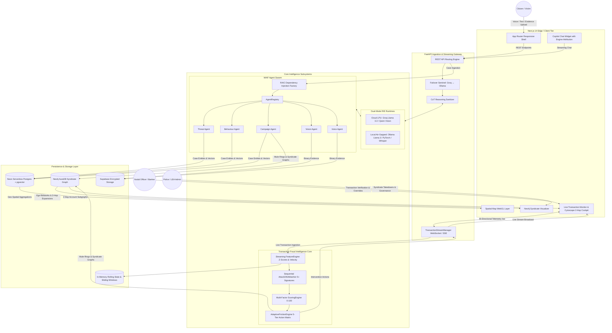

# Digital Rakshak: AI-Powered Cyber Threat & Transaction Fraud Intelligence Platform

Welcome to **Digital Rakshak**! 

When a citizen becomes a victim of a cyber scam or encounters counterfeit currency, the conventional process is reactive: file a complaint, receive a ticket number, and wait. But organized financial crime and digital syndicates operate at wire speed—scaling illicit operations within seconds across decentralized banking channels and mule networks.

**Digital Rakshak** flips the script. Instead of serving as a passive complaint repository, Digital Rakshak is an active, **Hybrid AI Threat Intelligence & Wire-Speed Transaction Fraud Prevention Platform**. It listens to victims, decodes attacker behavioral DNA, maps national crime syndicates, intercepts fraudulent transactions in sub-milliseconds, and provides zero-trust verification for citizens, banks, and Law Enforcement Agencies (LEAs).

---

## What Makes Digital Rakshak Unique?

### 1. Wire-Speed Transaction Fraud Intelligence & Adaptive Friction
Digital Rakshak natively integrates an ultra-low latency transaction inspection core capable of analyzing high-throughput UPI, IMPS, and card transactions in **microseconds (< 0.1 ms)**:
*   **Streaming Feature Engine:** Computes instantaneous velocity, burst frequency, deviation Z-scores, ratio deviations, and geographic velocity jumps using rolling time windows.
*   **Sequential Attack DNA Matcher:** Correlates real-time events against known cybercrime syndicates (e.g., Account Takeover probe-to-drain sequences, Mule Fan-Out distribution, Midnight Siphoning / Smurfing, and OTP Hijack loops).
*   **Proportional Adaptive Friction Engine:** Replaces brittle binary cutoffs (which block legitimate emergency medical payments or wedding purchases) with 5-tier dynamic countermeasures:
    1.  `APPROVE` (0–30): Instantaneous pass with zero customer friction.
    2.  `APPROVE_AND_MONITOR` (30–55): Seamless passage backed by passive audit logging.
    3.  `STEP_UP_CHALLENGE` (55–75): Dynamic stepped-up authentication (Biometrics / OTP), saving legitimate anomalies from false-positive rejections.
    4.  `TEMPORARY_HOLD` (75–90): 15-minute escrow hold with automated nodal escalation.
    5.  `HOLD_AND_INVESTIGATE` (90–100): Immediate hard freeze, LEA incident auto-filing, and 2-hop network quarantine.
*   **Bi-Directional WebSocket Streaming (`/v1/transactions/ws`):** Broadcasts live banking transaction telemetry, risk-band distributions, and anomaly alerts to banking dashboards in real time.
*   **Forensic Cockpit & 2-Hop Cytoscape Graph:** Visualizes immediate 2-hop ego-networks around sender accounts, recipient beneficiaries, shared device IDs, and IP clusters for rapid nodal intervention.

### 2. Multi-Agent Intelligence Swarm (MAIF)
Digital Rakshak coordinates a swarm of specialized autonomous AI agents via topological execution (Kahn's algorithm):
*   **Vision Agent:** Scans screenshots for counterfeit notes, malicious QR codes, and phishing landing pages.
*   **Threat & Behaviour Agents:** Deconstruct psychological manipulation tactics (urgency, authority, emotional coercion) mapped directly to MITRE ATT&CK standards.
*   **Campaign Agent:** Traverses graph topologies in Neo4j to cluster isolated complaints into coordinated syndicate campaigns.
*   **Voice Agent:** Ingests raw regional audio statements, handles noise cancellation, and executes multi-lingual transcription natively.

### 3. Dual-Mode AI Architecture (Cloud LPU vs. Air-Gapped Local)
Police departments and financial institutions handle sensitive Personally Identifiable Information (PII) subject to strict data sovereignty laws:
*   **Cloud Mode:** Leverages ultra-fast LPU inference via Groq (`llama-3.3-70b-versatile`) for rapid serverless scale.
*   **Local Air-Gapped Mode:** Runs 100% locally on on-premise LEA hardware using Ollama (`llama3:8b`), local PyTorch runtimes (MobileNetV3 for vision, XLM-RoBERTa for text), and `faster-whisper`—guaranteeing zero external data leakage.
*   **Transparent Rate-Limit Failover:** If cloud APIs hit HTTP 429 rate limits or network degradation, the gateway seamlessly fails over to the local Ollama daemon without session disruption.
*   **Chain-of-Thought (CoT) Sanitization:** Reasoning scratchpads (`<think>...</think>`) generated by modern reasoning models are automatically sanitized across REST and WebSocket streams, presenting clean, structured advisories to officers and citizens.
*   **Active Engine Attribution:** Real-time visibility into the currently active model directly inside the Copilot chat input box, footer telemetry, and response headers.

### 4. 6-Axis Threat DNA & Confidence Evolution
The platform computes a multi-dimensional risk matrix (Threat Severity, Behaviour, Network Linkage, Evidence Integrity, Impersonation, and Extraction). As LEAs and nodal bank officers confirm or refute artifacts, the **Confidence Score** evolves dynamically from a ~50% unverified baseline up to a verified 99% before triggering cross-institution account freezing.

### 5. Physical & Cyber Convergence (The Counterfeit Tracker)
Integrates digital fraud tracking with physical counterfeit currency detection. Suspicious currency uploads bypass standard NLP pipelines and route to our specialized Vision Engine, plotting physical recovery clusters on an isolated WebGL spatial layer to prevent graph pollution.

### 6. Tactical Command Center & Hardware Telemetry
A live tactical command center aggregates live PostgreSQL case volumes, real financial exposure figures, and regional threat clusters. It incorporates real-time hardware telemetry monitoring CPU/GPU utilization, VRAM allocation, and AI engine health.

---

## System Architecture

Digital Rakshak couples a high-performance Next.js 14 App Router frontend with a decoupled FastAPI orchestration layer, dual-mode intelligence runtimes, real-time WebSocket multiplexers, and a multi-model persistence tier.


```mermaid
graph TD
    %% User Personas
    Citizen((Citizen / Victim))
    Banker((Nodal Officer / Banker))
    Admin((Police / LEA Admin))

    %% Frontend Subsystem
    subgraph Frontend [Next.js 14 Edge / Client Tier]
        UI[App Router Responsive Shell]
        Map[Spatial Map WebGL Layer]
        GraphVis[Neo4j Syndicate Visualizer]
        TxCockpit[Live Transaction Monitor & Cytoscape 2-Hop Cockpit]
        ChatWidget[Copilot Chat Widget with Engine Attribution]
    end

    %% Ingestion & Streaming Layer
    subgraph Ingestion [FastAPI Ingestion & Streaming Gateway]
        APIRouter[REST API Routing Engine]
        WSManager[TransactionStreamManager WebSocket / SSE]
        RateLimitSentinel[Failover Sentinel: Groq ↔ Ollama]
        CoTSanitizer[CoT Reasoning Sanitizer]
    end

    %% Core Intelligence Engines
    subgraph Intelligence [Core Intelligence Subsystems]
        %% MAIF Swarm
        subgraph MAIF [MAIF Agent Swarm]
            Factory[RAIC Dependency Injection Factory]
            Registry[AgentRegistry]
            ThreatA[Threat Agent]
            BehA[Behaviour Agent]
            CampA[Campaign Agent]
            VisA[Vision Agent]
            VoiceA[Voice Agent]
        end

        %% Transaction Fraud Intelligence
        subgraph TxEngine [Transaction Fraud Intelligence Core]
            FeatureEng[Streaming FeatureEngine Z-Scores & Velocity]
            AttackDNA[Sequential AttackDNAMatcher 5+ Signatures]
            ScoringEng[Multi-Factor ScoringEngine 0-100]
            FrictionEng[AdaptiveFrictionEngine 5-Tier Action Matrix]
        end

        %% Dual-Mode RIE
        subgraph RIE [Dual-Mode RIE Runtimes]
            GroqCloud[Cloud LPU: Groq Llama 3.3 / Qwen Vision]
            LocalOllama[Local Air-Gapped: Ollama Llama 3 / PyTorch / Whisper]
        end
    end

    %% Multi-Model Persistence
    subgraph Persistence [Persistence & Storage Layer]
        PG[(Neon Serverless Postgres + pgvector)]
        Neo[(Neo4j AuraDB Syndicate Graph)]
        MemBuffer[(In-Memory Rolling State & Sliding Windows)]
        Storage[(Supabase Encrypted Storage)]
    end

    %% Ingestion Connections
    Citizen -->|Voice / Text / Evidence Upload| UI
    Banker -->|Transaction Verification & Overrides| TxCockpit
    Admin -->|Syndicate Takedowns & Governance| GraphVis

    UI -->|REST Endpoints| APIRouter
    ChatWidget -->|Streaming Chat| APIRouter
    TxCockpit <-->|Bi-Directional Telemetry /ws| WSManager

    APIRouter --> RateLimitSentinel
    RateLimitSentinel --> CoTSanitizer
    CoTSanitizer <--> RIE

    %% Pipeline Dispatches
    APIRouter -->|Case Ingestion| Factory
    Factory --> Registry
    Registry --> ThreatA & BehA & CampA & VisA & VoiceA
    MAIF <--> RIE

    WSManager -->|Live Transaction Ingestion| FeatureEng
    FeatureEng --> MemBuffer
    FeatureEng --> AttackDNA
    AttackDNA --> ScoringEng
    ScoringEng --> FrictionEng
    FrictionEng -->|Intervention Actions| WSManager
    WSManager -->|Live Stream Broadcast| TxCockpit

    %% Persistence Interconnects
    ThreatA & BehA & CampA -->|Case Entities & Vectors| PG
    CampA & FrictionEng -->|Mule Rings & Syndicate Graphs| Neo
    VisA & VoiceA -->|Binary Evidence| Storage
    PG -->|Geo-Spatial Aggregations| Map
    Neo -->|Ego-Networks & 2-Hop Expansions| GraphVis
    Neo -->|2-Hop Account Subgraphs| TxCockpit
```

---

## Quantitative Benchmark: The Adaptive Friction Advantage

We evaluated **5,000 synthetic Indian banking transactions** (UPI/IMPS/NEFT) comparing conventional static rule cutoffs against Digital Rakshak's **Adaptive Friction Engine**:

| Metric | Traditional Static Rules | Digital Rakshak Engine | Impact |
| :--- | :---: | :---: | :--- |
| **Fraud Recall Rate** | 71.43% | **100.00%** | **+28.57% higher detection** |
| **False Positive Hard Block Rate** | 3.05% | **0.00%** | **Zero wrongful disruptions for customers** |
| **Legitimate Transactions Saved** | 0 (Blocked) | **142** | Converted from hard drop to stepped-up OTP |
| **Legitimate Volume Preserved** | ₹0 | **₹1,10,98,380.68** | **₹1.10+ Crores saved from payment failures** |
| **Coordinated Attack DNA Matches** | 0 | **320** | Full syndicate pattern correlation |
| **Average Processing Latency** | < 0.1 ms | **0.056 ms (56 µs)** | Sub-millisecond wire-speed throughput |
| **P95 Processing Latency** | < 0.1 ms | **0.071 ms (71 µs)** | Strict low-jitter real-time SLO |

### Key Architectural Takeaway
Traditional fraud systems penalize legitimate anomalies (e.g., late-night emergency hospital payments, festive jewelry shopping, or overseas flight bookings) with rigid hard blocks. 
* Digital Rakshak reserves hard freezes strictly for high-confidence syndicate attacks.
* Genuine atypical payments are redirected to **Adaptive Step-Up Authentication (OTP / Biometrics)**, preserving customer goodwill while locking out threat actors.

---

## The Technology Stack

*   **Frontend Interface:** Next.js 14 (App Router), React, TypeScript, Tailwind CSS, Cytoscape.js (for 2-hop transaction forensic topology), MapLibre GL (for spatial clustering), Recharts (for 6-axis threat radar).
*   **Backend Orchestration:** FastAPI (Python 3.12+), Pydantic v2 schemas, asyncio high-throughput event loops.
*   **Streaming & Realtime:** Native WebSockets (`/v1/transactions/ws`) with auto-reconnecting clients and broadcast hubs.
*   **Relational & Vector Store:** Neon Serverless PostgreSQL with `pgvector` for vector similarity clustering and PgBouncer connection pooling.
*   **Graph Database:** Neo4j AuraDB (Cypher query language) for mule account discovery, syndicate graph traversal, and 2-hop ego-network isolation.
*   **Evidence Storage:** Supabase Encrypted Storage with magic-byte validation and anti-tamper hash logging.
*   **AI Models & Runtimes:**
    *   *Cloud:* Groq LPU (`llama-3.3-70b-versatile`, `llama-3.1-8b-instant`, Qwen 2.5 Vision).
    *   *Local Air-Gapped:* Ollama (`llama3:8b`), PyTorch (MobileNetV3 for currency analysis, XLM-RoBERTa for multilingual extraction), `faster-whisper`.

---

## 🔐 Demo Credentials (For Evaluators & Judges)

Explore the platform through pre-configured roles:

| Role | Email | Password | Accessible Modules |
|------|-------|----------|-------------------|
| 👮 Police / Investigator | `police1@rakshak.com` | `police@123` | Case Workbench, Evidence Analysis, Syndicate Graph, Hardware Telemetry |
| 🏦 Banker / Nodal Officer | `banker1@rakshak.com` | `banker@123` | **Transaction Fraud Intelligence Cockpit**, Live WebSocket Stream, 2-Hop Cytoscape Forensics, Case Verification |
| 👤 Citizen / Victim | `citizen1@rakshak.com` | `citizen@123` | Voice / Text Incident Reporting, Counterfeit Note Scanner, Status Tracker, Copilot Help Chat |
| 🏛️ Admin / Superintendent | `admin1@rakshak.com` | `admin@123` | Tactical Command Center, Global Audit Logs, User Management, AI Engine Failover Governance |

> **Note:** Demo accounts are pre-seeded with case data, transaction streams, and graph links.

---

## Getting Started (Local Development)

### 1. Start Database Services
Spin up PostgreSQL and Neo4j using Docker:
```bash
docker-compose up -d
```

### 2. Boot the Backend (FastAPI)
```bash
cd backend
python -m venv venv

# Windows:
venv\Scripts\activate
# Linux/macOS:
source venv/bin/activate

pip install -r requirements.txt
```

Create `backend/.env` containing your database strings and API keys:
```env
DATABASE_URL=postgresql+psycopg2://<user>:<pass>@<host>/<db>?sslmode=require
NEO4J_URI=neo4j+s://<host>:7687
NEO4J_USERNAME=neo4j
NEO4J_PASSWORD=<password>
GROQ_API_KEY=<your_groq_key>
OLLAMA_BASE_URL=http://localhost:11434
```

Run migrations, seed intelligence data, and launch the server:
```bash
alembic upgrade head
python scripts/seed_diverse_cases.py
uvicorn main:app --reload --port 8000
```

### 3. Boot the Frontend (Next.js)
```bash
cd frontend
npm install
```

Configure `frontend/.env.local`:
```env
NEXT_PUBLIC_API_URL=http://127.0.0.1:8000/v1
```

Run the development server:
```bash
npm run dev
```
Navigate to **`http://localhost:3000`** in your browser.

---

## Docker Hub Quick Start (Pre-Built Images)

Pull and run production images directly:

```bash
# Backend Service
docker pull 1065925/digital-rakshak-backend:latest
docker run -d -p 8000:8000 --env-file ./backend/.env --name dr-backend 1065925/digital-rakshak-backend:latest

# Frontend Service
docker pull 1065925/digital-rakshak-frontend:latest
docker run -d -p 3000:3000 --env-file ./frontend/.env.local --name dr-frontend 1065925/digital-rakshak-frontend:latest
```

---

## Contributors

* **beastspirit2005 (Harshit Sharma)** - Backend Architecture & System Design
* **pranikaK17 (Pranika)** - Frontend & UX Design
* **DikshaChopra2007 (RuntimeTerror)** - Frontend Design & Interactive Visualizations
* **Tanmay Sao** - Documentation, Testing, Demo Video & Presentation

---

**Developed to build a safer, zero-trust digital India.**

